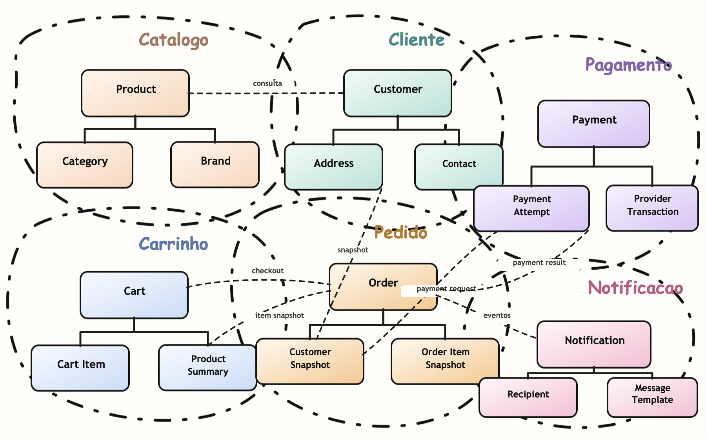
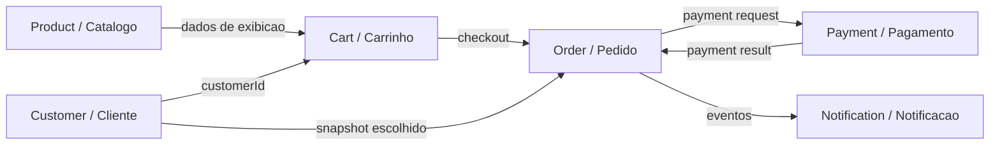
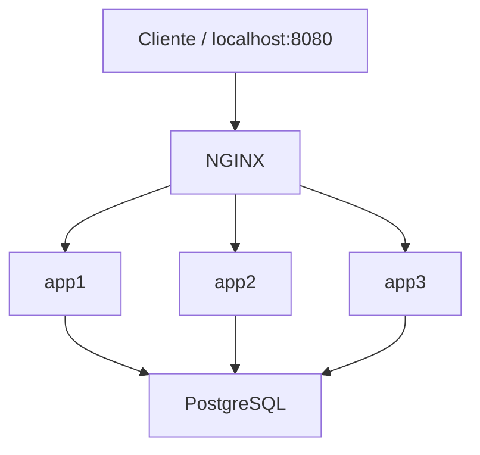

# Nexus Shopping Backend

> **Nexus** (do latim *nectere*, "atar, ligar"): um ponto de conexao central. O nome reflete a arquitetura hexagonal do projeto -- o dominio como nexus entre adapters de entrada e saida -- e o dominio de negocio: um catalogo que conecta produtos, marcas e categorias.

Backend REST API educacional construido com Kotlin, Java 21, Spring Boot 4, Actuator, Flyway, PostgreSQL e Spring Data JPA.

O projeto evolui de forma incremental, cobrindo diferentes topicos em aulas progressivas: performance de banco de dados, arquitetura hexagonal, tratamento de erros padronizado, logging estruturado, load balancing e, agora, decomposicao de dominios para discutir microservices. Cada topico importante fica documentado em branches, tags, ADRs e guias reproduziveis.

## Trilha didatica

1. **Performance de leitura**: tabela grande, queries sem indice, indices e paginacao.
2. **Arquitetura de aplicacao**: Ports and Adapters, use cases, DTOs e adapters.
3. **Operacao e observabilidade**: health check, logging estruturado e correlation-id.
4. **Escalabilidade horizontal**: multiplas instancias atras de NGINX local e Load Balancer na AWS.
5. **Sistemas distribuidos**: novos Bounded Contexts de e-commerce para evoluir de monolito modular para microservices.

## Topicos e Branches

| Branch | Execucao | Topico |
| --- | --- | --- |
| `missing-index-performance-baseline` | Docker Hub `:baseline` | Performance sem indices secundarios |
| `add-product-query-indexes` | Docker Hub `:indexes` | Impacto de indices de leitura |
| `add-products-pagination` | Docker Hub `:pagination` | Paginacao e custo de retorno de linhas |
| `hexagonal-architecture` | tag `v2.0-hexagonal` | Arquitetura hexagonal (Ports and Adapters) |
| `scalability-and-load-balancer` | Docker Compose local | NGINX distribuindo trafego entre 3 instancias |
| `main` | branch estavel | Versao estavel mais recente |

Veja tambem [REFERENCE_POINTS.md](REFERENCE_POINTS.md) para as tags imutaveis de estudo.

## Evolucao para E-commerce

O codigo atual ainda tem Product/Catalogo como dominio implementado. A proxima etapa ja esta documentada como decisao arquitetural: evoluir para um monolito modular com contextos de e-commerce antes de extrair microservices.



Contextos decididos:



Decisoes principais:

- Decomposicao de dominio primeiro; distribuicao fisica depois.
- `Checkout` e um fluxo, nao um Bounded Context separado nesta fase.
- `Customer` e dono dos dados cadastrais, mas `Order` guarda snapshot historico.
- `Product` no catalogo, `ProductSummary` no carrinho e `OrderItemSnapshot` no pedido nao sao o mesmo modelo global.
- `Payment` deve ser o primeiro candidato a extracao futura, por proteger o core de uma integracao externa.
- `Inventory` e `Auth/Identity` ficam fora de escopo nesta etapa.

ADR completo: [docs/decisions/2026-07-17-prd-commerce-bounded-contexts.md](docs/decisions/2026-07-17-prd-commerce-bounded-contexts.md).

## Architecture

O projeto segue arquitetura hexagonal (Ports and Adapters), aplicada de forma incremental. A regra de dependencia e `adapter -> application -> domain`.

```
com/nexus/shopping/
  product/
    domain/           -> tipos de negocio puros
    application/
      port/outbound/  -> portas outbound
      usecase/        -> orquestracao e validacao
      command/        -> comandos de entrada dos use cases
      exception/      -> excecoes tipadas do dominio de aplicacao
    adapter/
      inbound/http/   -> controllers e DTOs
      outbound/jpa/   -> entidades JPA e adapters de persistencia
  platform/           -> excecoes e handlers compartilhados
  infra/              -> detalhes tecnicos transversais (HTTP, correlation-id)
```

Restricoes de design:
- Domain e use cases sem imports de Spring, JDBC ou JPA.
- JPA fica isolado no adapter outbound, que implementa `ProductRepositoryPort`, mapeia `ProductEntity` para `Product` e usa `@Query` JPQL nas consultas de leitura para manter explicito o shape das queries de performance.
- Validacao nos use cases para reuso por qualquer adaptador futuro (CLI, fila, batch).
- DTO HTTP vira command via `toCommand()`.
- Entity JPA vira domain via `toDomain()`.

## Requirements

Para testes de carga apenas:

- Docker e Docker Compose
- Apache JMeter

Para desenvolvimento local:

- Java 21
- Docker e Docker Compose
- Gradle Wrapper (incluido como `./gradlew`)

Instalar JMeter no macOS:

```bash
brew install jmeter
```

## Database

PostgreSQL via Docker Compose:

```bash
docker compose up -d postgres
```

Configuracoes padrao:

- URL: `jdbc:postgresql://localhost:5432/nexus_shopping`
- Database: `nexus_shopping`
- User: `nexus`
- Password: `nexus`

O Flyway executa automaticamente ao iniciar a aplicacao e cria:

- Tabelas: `brands`, `categories`, `products`
- Seed de produtos configuravel via `PRODUCT_SEED_COUNT`
- Indexes: `idx_products_category_id`, `idx_products_name`

O default da aplicacao e `1000`, para boot rapido em desenvolvimento e demos locais. Para cenarios de performance, sobrescreva explicitamente:

```bash
PRODUCT_SEED_COUNT=10000000 docker compose up -d --build
```

Para resetar o volume local apos mudancas de migrations:

```bash
docker compose down -v
docker compose up -d postgres
```

## Run

Aplicacao local com uma instancia:

```bash
docker compose up -d postgres
env PRODUCT_SEED_COUNT=1000 GRADLE_USER_HOME=.gradle-local ./gradlew bootRun
```

Health:

```bash
curl http://localhost:8080/actuator/health
```

Busca por categoria:

```bash
curl 'http://localhost:8080/products?categoryId=1&page=0&size=50'
```

Busca por nome:

```bash
curl 'http://localhost:8080/products?name=Product%202999999&page=0&size=50'
```

Criar produto:

```bash
curl -X POST http://localhost:8080/products \
  -H 'Content-Type: application/json' \
  -d '{"brandId":1,"categoryId":1,"sku":"SKU-001","name":"New Product","slug":"new-product","priceAmount":49.90}'
```

Stack local com NGINX e 3 instancias:

```bash
PRODUCT_SEED_COUNT=1000 docker compose up -d --build
./scripts/test-lb.sh 30
```

## Docker Image

O projeto usa o task nativo do Spring Boot para geracao de imagem OCI via Cloud Native Buildpacks (cenarios de performance no Docker Hub). Ha tambem um `Dockerfile` multi-stage usado pelo setup de load balancing (`docker compose build`).

Build local com buildpacks:

```bash
env GRADLE_USER_HOME=.gradle-local ./gradlew bootBuildImage --imageName nexus-shopping:local
```

Push dos cenarios para o Docker Hub:

```bash
make push-baseline
make push-indexes
make push-pagination
```

## Load Balancing (NGINX)

Setup com 3 instancias da aplicacao atras de um NGINX (round-robin por padrao),
para demonstrar balanceamento de carga sem Kubernetes.

Topologia:



Guia completo (subir, testar, trocar algoritmo) e roteiro de teste/verificacao:

```
docs/scalability-and-load-balancer/load-balancing-nginx.md      # setup, topologia e algoritmos
docs/scalability-and-load-balancer/load-balancing-test-plan.md  # roteiro de teste e verificacao
```

## Test

```bash
env GRADLE_USER_HOME=.gradle-local ./gradlew build
```

Os testes automatizados validam:

- Spring Boot inicia com o health endpoint do Actuator.
- Flyway executa automaticamente.
- O endpoint de produtos funciona com seed de teste reduzido.
- Migrations portaveis entre PostgreSQL e H2.
- Indexes de leitura presentes sem constraints UNIQUE indesejadas.

## Lint

Lint Kotlin configurado com ktlint via Gradle. Na fase inicial, e opt-in e nao faz parte do `build`.

```bash
env GRADLE_USER_HOME=.gradle-local ./gradlew ktlintCheck    # verifica estilo
env GRADLE_USER_HOME=.gradle-local ./gradlew ktlintFormat   # autoformata
```

## Testes de Carga

Os testes de carga comparam os tres cenarios de performance sob alta concorrencia com JMeter.

Guia completo de instalacao, execucao e interpretacao de resultados:

```
docs/jmeter-test-guide.md
```

Resultados documentados:

```
docs/load-test-results-20260626.md           baseline sem indices
docs/load-test-index-results-20260626.md     com indices
docs/load-test-pagination-results-20260627.md  com paginacao
```

Relatorios HTML do JMeter: `docs/jmeter-reports/`.

## Documentation

- `docs/decisions/` - registros de decisao arquitetural (ADRs)
- `docs/superpowers/specs/` - especificacoes de features
- `docs/jmeter-test-guide.md` - guia completo de testes de carga
- `docs/scalability-and-load-balancer/` - setup e roteiro de load balancing local
- `docs/assets/bounded-contexts/` - mapa visual dos Bounded Contexts planejados
