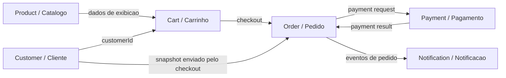
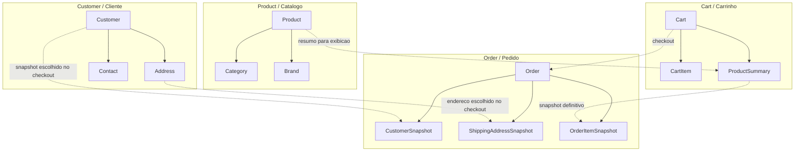
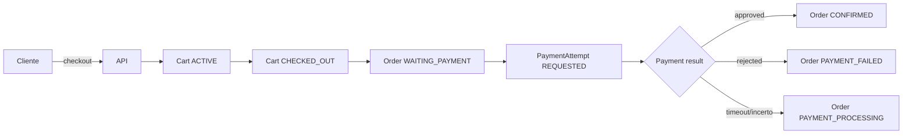
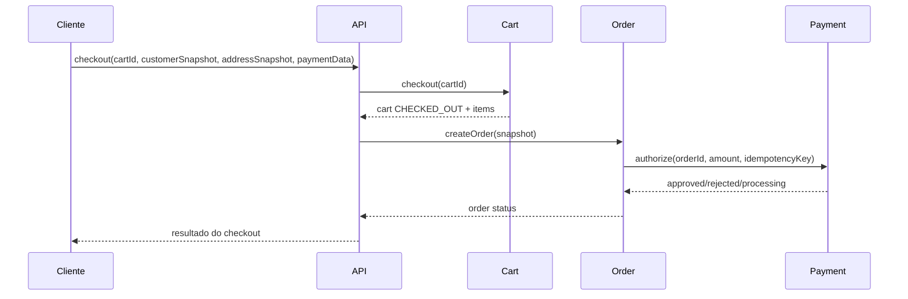
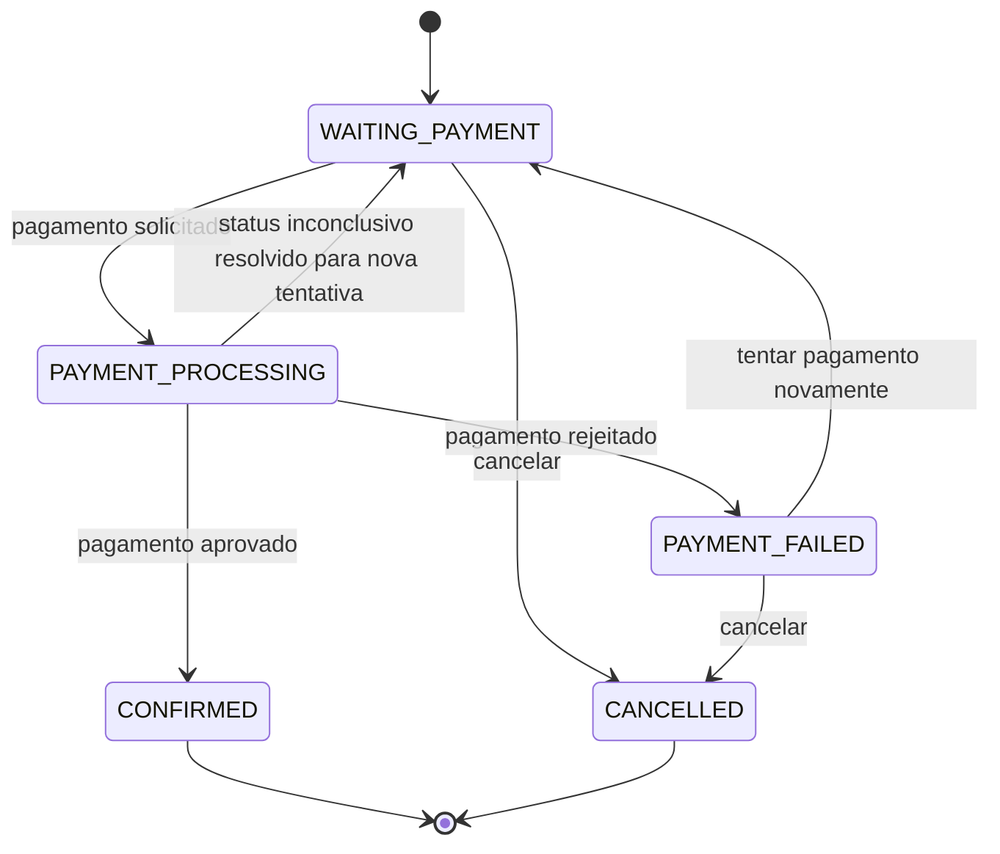
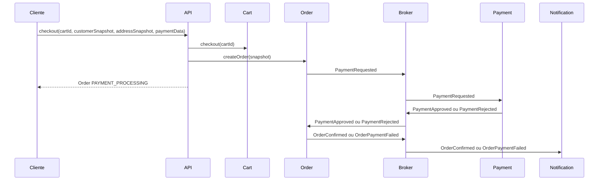
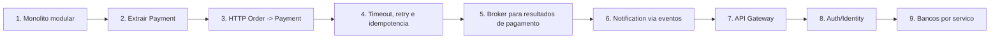

# ADR: Evoluir o Nexus Shopping para dominios de e-commerce e microservices

**Status:** Aceita
**Data:** 2026-07-17
**Assets relacionados:** `docs/assets/bounded-contexts/nexus-shopping-bounded-context-map.svg`

---

## Contexto

O Nexus Shopping e um projeto didatico usado para ensinar System Design, performance e sistemas distribuidos.

A primeira etapa do projeto focou no dominio de produtos e em problemas de leitura em grande volume:

- queries sem indices;
- indices secundarios em `category_id` e `name`;
- paginacao sem `COUNT(*)`;
- load balancer local com Docker Compose;
- load balancer na AWS com Elastic Beanstalk, RDS e Load Balancer gerenciado.

O proximo passo da trilha e introduzir microservices. Antes de distribuir fisicamente a aplicacao, a decisao e separar os dominios dentro do proprio sistema para deixar claro onde estao os Bounded Contexts e quais fronteiras existem entre eles.

A referencia conceitual e a ideia de Bounded Context de Martin Fowler: o mesmo termo pode existir em mais de um contexto, mas com modelos, regras e significados diferentes. No Nexus Shopping, `Product` no catalogo, `Product Summary` no carrinho e `Order Item Snapshot` no pedido nao devem ser tratados como um unico modelo global.

---

## Objetivos

1. Expandir o projeto para representar um fluxo realista de e-commerce.
2. Criar dominios que permitam discutir microservices sem cair apenas em CRUD distribuido.
3. Separar decomposicao de dominio de distribuicao fisica.
4. Preparar o caminho para API Gateway, comunicacao HTTP, mensageria, consistencia eventual e observabilidade.
5. Manter o foco didatico em arquitetura de sistemas distribuidos, nao em complexidade de login, estoque ou engenharia de software avancada nesta etapa.

---

## Alternativas consideradas

### 1. Comecar por Inventory

Adicionar um dominio de estoque logo apos Product.

Pontos positivos:

- Introduz concorrencia, reserva, overselling e consistencia.
- Cria uma separacao natural entre catalogo e disponibilidade.

Trade-offs:

- Muda o foco da trilha para concorrencia e integridade de estoque.
- Aumenta cedo demais a complexidade do fluxo de compra.
- Nao e necessario para discutir API Gateway, comunicacao entre servicos, pagamento e mensageria.

### 2. Comecar por Cart, Order, Payment e Notification

Adicionar carrinho, pedido, pagamento e notificacao como dominios de e-commerce.

Pontos positivos:

- Cria um fluxo de negocio completo: montar carrinho, fechar pedido, pagar e notificar.
- Introduz estados de pedido, tentativas de pagamento, falhas parciais e idempotencia.
- Payment representa integracao externa e justifica uma fronteira de servico clara.
- Notification e um bom candidato para comunicacao assincrona.

Trade-offs:

- Ainda nao cobre problemas de estoque ou concorrencia de disponibilidade.
- Exige modelar snapshots para evitar acoplamento entre Customer, Product, Cart e Order.

### 3. Introduzir Auth/Identity agora

Adicionar autenticacao, autorizacao e identidade como dominio inicial.

Pontos positivos:

- Aproxima a arquitetura de uma aplicacao real.
- Prepara a discussao de API Gateway, JWT e propagacao de identidade.

Trade-offs:

- Desvia o foco para seguranca antes da discussao principal de comunicacao entre servicos.
- Puxa decisoes sobre token, sessao, OAuth, roles e autorizacao.
- Nao e necessario para modelar o fluxo de compra neste momento.

---

## Decisao

Usar a alternativa 2: **evoluir o Nexus Shopping para um monolito modular com os contextos Product, Customer, Cart, Order, Payment e Notification**.

A distribuicao fisica em microservices acontecera depois. Primeiro, o projeto deve deixar os Bounded Contexts explicitos dentro da mesma aplicacao. Essa ordem preserva uma mensagem didatica importante:

```text
Decomposicao de dominio primeiro.
Distribuicao fisica depois.
```

Mapa inicial dos contextos:



Nesta etapa:

- `Inventory` fica fora de escopo.
- `Auth/Identity` fica fora de escopo.
- `Checkout` nao sera tratado como Bounded Context separado.
- O banco pode continuar compartilhado enquanto os dominios ainda estiverem na mesma aplicacao.
- A primeira extracao futura recomendada e `Payment`, por representar integracao com parceiro externo e uma fronteira de volatilidade.

---

## Bounded Contexts decididos

### Product / Catalogo

Responsavel por catalogo, descoberta e leitura de produtos.

Modelo conceitual:

```text
Product
Category
Brand
```

Regras:

- E o dono dos dados de catalogo.
- Continua sendo o dominio principal para aulas de indices, paginacao e performance de leitura.
- Outros contextos nao devem depender de um modelo vivo e completo de `Product`.

### Customer / Cliente

Responsavel pelos dados cadastrais do comprador.

Modelo conceitual:

```text
Customer
Address
Contact
```

Regras:

- Customer e dono dos dados pessoais do comprador.
- Auth/Identity nao entra agora.
- As operacoes assumem que o cliente ja esta identificado por um `customerId`.
- O `customerId` e confiavel nesta fase didatica.
- Mais tarde, com API Gateway/Auth, o `customerId` deve vir da identidade autenticada, nao do corpo da requisicao.

### Cart / Carrinho

Responsavel pela intencao temporaria de compra.

Modelo conceitual:

```text
Cart
CartItem
ProductSummary
```

Regras:

- Todo carrinho pertence a um `customerId`.
- Nao existe carrinho anonimo nesta etapa.
- Um Customer pode ter no maximo um Cart `ACTIVE`.
- O carrinho e mutavel.
- O carrinho pode guardar dados denormalizados de produto para exibicao, como nome e preco unitario.
- Esses dados no carrinho nao sao a verdade historica da compra.

Estados:

```text
ACTIVE
CHECKED_OUT
ABANDONED
```

### Order / Pedido

Responsavel pelo compromisso comercial da compra.

Modelo conceitual:

```text
Order
CustomerSnapshot
ShippingAddressSnapshot
OrderItemSnapshot
```

Regras:

- Order nao e apenas um carrinho salvo.
- Quando o checkout acontece, o carrinho deixa de ser a fonte da verdade.
- Order cria o snapshot historico definitivo de cliente, endereco e itens.
- Order nao deve consultar Customer durante a criacao do pedido.
- O fluxo de checkout deve enviar os dados escolhidos de cliente/endereco junto com os itens do carrinho.
- Se Customer ou Product mudarem depois, a Order antiga nao deve mudar.

Estados iniciais:

```text
WAITING_PAYMENT
PAYMENT_PROCESSING
PAYMENT_FAILED
CONFIRMED
CANCELLED
```

Observacoes:

- `PAYMENT_FAILED` e recuperavel.
- Uma Order com pagamento falho pode receber nova tentativa de pagamento.
- Timeout de pagamento nao deve ser tratado como rejeicao definitiva.
- `PAYMENT_PROCESSING` existe para representar incerteza distribuida.

### Payment / Pagamento

Responsavel por processar pagamento e proteger o core da aplicacao de detalhes do parceiro externo.

Modelo conceitual:

```text
Payment
PaymentAttempt
ProviderTransaction
```

Regras:

- Payment abstrai a integracao externa.
- A primeira versao pode simular o provedor.
- O core da aplicacao nao deve depender diretamente do parceiro de pagamento.
- A Order pode ter varias tentativas de pagamento.
- Cada tentativa deve ter uma chave de idempotencia.

`PaymentAttempt` conceitual:

```text
PaymentAttempt
- id
- orderId
- amount
- status: REQUESTED | APPROVED | REJECTED | ERROR
- provider
- providerTransactionId
- idempotencyKey
- createdAt
```

### Notification / Notificacao

Responsavel por comunicar eventos importantes ao cliente.

Modelo conceitual:

```text
Notification
Recipient
MessageTemplate
```

Regras:

- Notification nao deve bloquear checkout.
- Notification e um bom primeiro consumidor de eventos quando a mensageria for introduzida.
- Pode notificar confirmacao, falha de pagamento ou cancelamento.

---

## Fronteiras e visibilidade entre contextos

Visao de ownership e snapshots:



### Customer nao e consultado por Order no checkout

Decisao:

```text
Checkout envia customerId, customerSnapshot e shippingAddressSnapshot para Order.
Order persiste esses dados como fato historico.
```

Motivo:

- Evita acoplamento sincrono entre Order e Customer.
- Preserva o historico da compra.
- Prepara o terreno para microservices e consistencia eventual.

### Product nao e modelo global

Decisao:

```text
Catalogo possui Product.
Cart possui ProductSummary.
Order possui OrderItemSnapshot.
```

Motivo:

- Product no catalogo e o dado vivo.
- ProductSummary no carrinho serve para exibicao e experiencia de usuario.
- OrderItemSnapshot representa o que foi comprado naquele momento.

### Checkout e fluxo, nao contexto

Decisao:

```text
Checkout nao sera um Bounded Context separado nesta fase.
```

Motivo:

- Checkout orquestra Cart, Order e Payment.
- Ainda nao ha regra suficiente para justificar um contexto proprio.
- Criar um Checkout Service agora aumentaria o escopo sem ganho didatico imediato.

---

## Fluxo principal inicial

Na primeira versao, o checkout cria a Order e a Order inicia o pagamento.

Fluxo conceitual entre dominios:





Regras do fluxo:

1. Cart precisa estar `ACTIVE`.
2. Checkout muda Cart para `CHECKED_OUT` imediatamente.
3. Order nasce como `WAITING_PAYMENT`.
4. Order inicia a primeira `PaymentAttempt`.
5. Payment retorna aprovacao, rejeicao ou incerteza.
6. Order muda para `CONFIRMED`, `PAYMENT_FAILED` ou `PAYMENT_PROCESSING`.

---

## Retry de pagamento

Uma Order em `PAYMENT_FAILED` pode receber nova tentativa de pagamento.



Motivo:

- Em e-commerce real, falha de pagamento nao encerra necessariamente o pedido.
- Nova tentativa permite discutir idempotencia, historico de tentativas e efeitos externos.
- O aluno consegue ver que pagamento nao e uma flag booleana.

---

## Evolucao para comunicacao assincrona

Depois da primeira versao sincrona, o mesmo fluxo deve evoluir para mensageria.



Essa evolucao permite ensinar:

- diferenca entre comunicacao sincrona e assincrona;
- consistencia eventual;
- estados intermediarios;
- polling ou consulta posterior de status;
- eventos de dominio;
- consumidores independentes;
- tolerancia a falhas;
- necessidade de idempotencia.

---

## Eventos conceituais

Eventos iniciais:

```text
OrderCreated
PaymentRequested
PaymentApproved
PaymentRejected
OrderConfirmed
OrderPaymentFailed
OrderCancelled
NotificationRequested
NotificationSent
NotificationFailed
```

Regra:

- Evento descreve algo que aconteceu.
- Estado descreve onde a entidade esta agora.
- Nem todo evento precisa virar estado.
- Nem todo estado precisa ser exposto como evento publico.

---

## Caminho de extracao para microservices

Ordem recomendada:

1. Monolito modular com contextos explicitos.
2. Extrair Payment primeiro.
3. Introduzir comunicacao HTTP entre Order e Payment.
4. Mostrar timeout, retry, falha parcial e idempotencia.
5. Introduzir mensageria para Payment result e Notification.
6. Adicionar API Gateway.
7. Adicionar Auth/Identity e propagacao de identidade.
8. Separar bancos por servico quando a aula chegar em ownership de dados.

Roadmap visual:



Motivo para extrair Payment primeiro:

- Payment representa uma integracao externa.
- Trocar parceiro de pagamento nao deve afetar o core.
- E uma fronteira de volatilidade clara.
- E um bom ponto para demonstrar falhas distribuidas reais.

---

## Fora de escopo nesta decisao

- Inventory e reserva de estoque.
- Carrinho anonimo.
- Login, OAuth, JWT, roles e autorizacao.
- API Gateway.
- Banco separado por servico.
- Broker real.
- Saga completa.
- Entrega, frete e fulfilment.
- Devolucao, reembolso e chargeback.
- Integracao real com gateway de pagamento.

Esses temas continuam importantes, mas entram melhor depois que o aluno enxergar o fluxo base de compra e as primeiras fronteiras entre contextos.

---

## Consequencias

Pontos positivos:

- O projeto passa a representar um e-commerce mais completo.
- Os dominios criam problemas distribuidos naturais.
- A evolucao para microservices fica gradual e explicavel.
- Payment e Notification dao bons ganchos para HTTP, mensageria e consistencia eventual.
- Snapshots evitam o erro de tratar `Customer` e `Product` como modelos globais.

Trade-offs:

- O sistema ainda nao trata disponibilidade de estoque.
- O `customerId` e assumido como confiavel ate Auth/API Gateway entrarem.
- O banco compartilhado simplifica a primeira etapa, mas tera que ser revisto ao separar servicos.
- O fluxo de checkout inicial ainda pode parecer mais simples do que um e-commerce real.

Risco didatico:

- Se os contextos forem distribuidos fisicamente cedo demais, a aula pode virar infraestrutura antes de o aluno entender as fronteiras de dominio.

Mitigacao:

- Comecar com monolito modular.
- Explicitar Bounded Contexts no codigo e na documentacao.
- Extrair servicos apenas quando houver uma dor arquitetural a demonstrar.

---

## Score de arquitetura

Score atual da decisao: **8/10**.

Pontos fortes:

- As fronteiras de dominio estao claras.
- A decisao evita microservices prematuros.
- O fluxo cria dores reais para aulas futuras.
- Product, Customer, Cart e Order nao compartilham um modelo unico global.

Melhorias para chegar a 10/10:

- Definir os contratos HTTP iniciais de Cart, Order e Payment.
- Definir os eventos publicos e seus payloads.
- Definir como os pacotes ficarao organizados no monolito modular.
- Definir criterios para quando um contexto pode ser extraido para servico separado.

---

## Proximos passos

1. Criar uma spec de implementacao para o monolito modular com Customer, Cart, Order, Payment e Notification.
2. Definir endpoints didaticos minimos.
3. Definir comandos/use cases principais.
4. Definir migrations e tabelas iniciais.
5. Definir testes de contrato dos fluxos principais.
6. Implementar a primeira versao ainda na mesma aplicacao.
