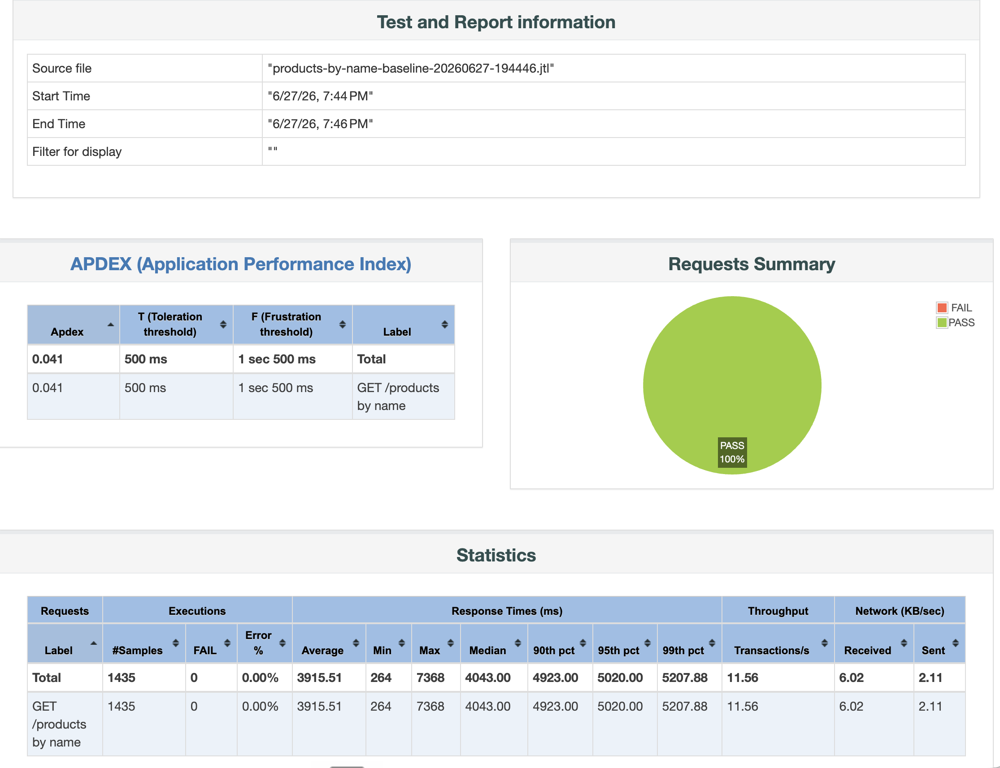
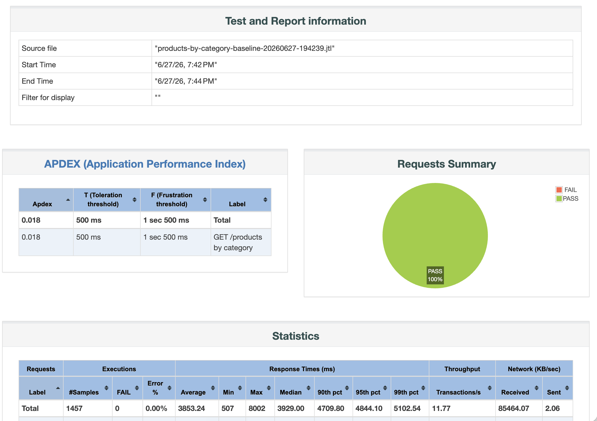
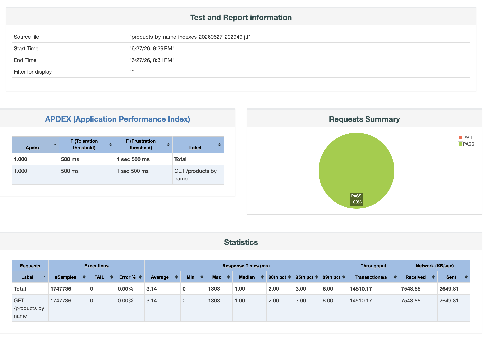
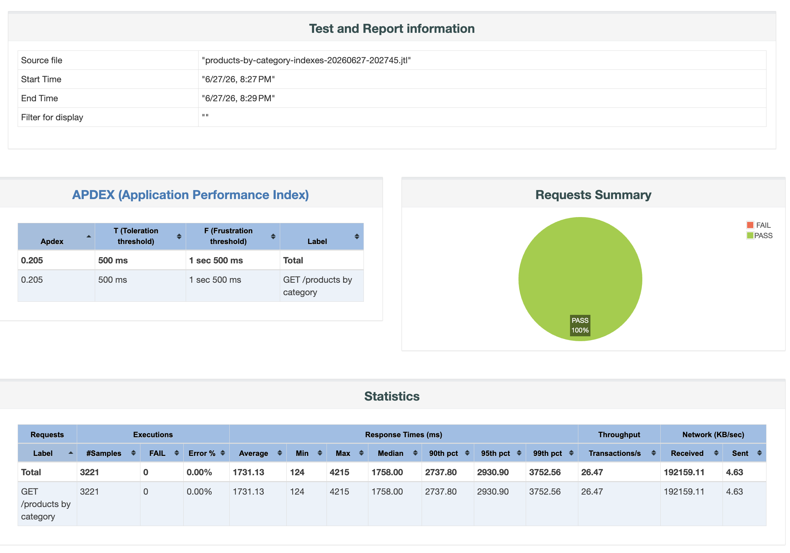
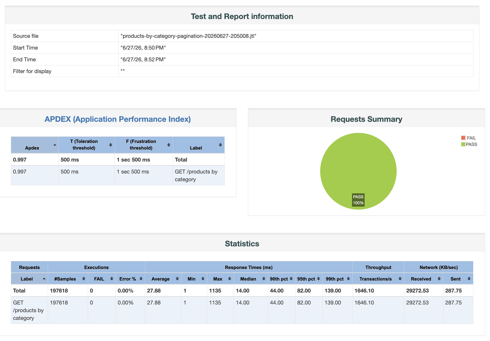
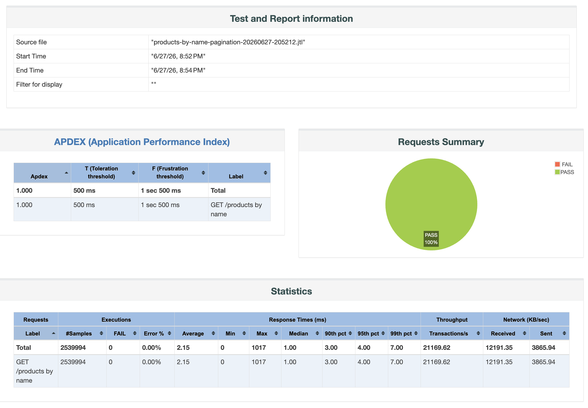

# Roteiro de Teste de Carga com JMeter

Este roteiro guia a execucao comparativa dos tres cenarios de performance do projeto e ensina a interpretar os resultados. Voce nao precisa conhecer o codigo para executar os testes.

## O que este projeto demonstra

O banco de dados e populado com 10 milhoes de produtos, 1.000 marcas e 500 categorias. Dois endpoints sao testados repetidamente sob carga concorrente:

```
GET /products?categoryId=1&page=0&size=50
GET /products?name=Product%209999999&page=0&size=50
```

Cada cenario representa uma evolucao do codigo, disponivel como imagem publica no Docker Hub:

| Cenario | Imagem Docker Hub | O que muda |
| --- | --- | --- |
| Baseline | `fabianofsc/nexus-shopping:baseline` | Sem indices secundarios |
| Indices | `fabianofsc/nexus-shopping:indexes` | Adiciona indices em `category_id` e `name` |
| Paginacao | `fabianofsc/nexus-shopping:pagination` | Limita a 50 registros por resposta |

## Pre-requisitos

Voce precisa de tres ferramentas instaladas: **Docker**, **JMeter** e **Make**. Nao e necessario ter Java, Gradle nem entender o codigo-fonte.

### macOS

```bash
brew install --cask docker
brew install jmeter
```

O `make` ja vem instalado no macOS com as ferramentas de linha de comando do Xcode. Se nao tiver:

```bash
xcode-select --install
```

Apos instalar o Docker, abra o aplicativo Docker Desktop pelo Launchpad para inicializar o servico antes de continuar.

### Linux (Ubuntu/Debian)

```bash
# Docker
sudo apt-get update
sudo apt-get install -y ca-certificates curl
sudo install -m 0755 -d /etc/apt/keyrings
sudo curl -fsSL https://download.docker.com/linux/ubuntu/gpg -o /etc/apt/keyrings/docker.asc
echo "deb [arch=$(dpkg --print-architecture) signed-by=/etc/apt/keyrings/docker.asc] \
  https://download.docker.com/linux/ubuntu $(. /etc/os-release && echo "$VERSION_CODENAME") stable" \
  | sudo tee /etc/apt/sources.list.d/docker.list > /dev/null
sudo apt-get update
sudo apt-get install -y docker-ce docker-ce-cli containerd.io docker-compose-plugin

# Permitir Docker sem sudo
sudo usermod -aG docker $USER
newgrp docker

# JMeter
sudo apt-get install -y default-jre
wget https://downloads.apache.org/jmeter/binaries/apache-jmeter-5.6.3.tgz
tar -xzf apache-jmeter-5.6.3.tgz
sudo mv apache-jmeter-5.6.3 /opt/jmeter
echo 'export PATH=$PATH:/opt/jmeter/bin' >> ~/.bashrc
source ~/.bashrc

# Make
sudo apt-get install -y make
```

> Essas instrucoes valem tambem para Windows com WSL 2 (Windows Subsystem for Linux). Ative o WSL 2, instale o Ubuntu pela Microsoft Store e siga os passos do Linux acima dentro do terminal Ubuntu.

### Verificar instalacao

```bash
docker --version
docker compose version
jmeter --version
make --version
```

Todos os comandos devem retornar uma versao sem erro.

## Inicio rapido

Clone o repositorio uma unica vez:

```bash
git clone https://github.com/fabianofsc/nexus-shopping.git
cd nexus-shopping
```

O roteiro completo usa dois comandos por cenario: um para preparar o ambiente e outro para executar os testes.

### Cenario 1: Baseline

Baixa a imagem, recria o banco do zero, popula 10 milhoes de produtos e aguarda a aplicacao ficar pronta:

```bash
make start-baseline
```

Quando o terminal exibir `health OK`, execute os testes:

```bash
make jmeter-all SCENARIO=baseline
```

O seed de 10 milhoes de produtos ocorre nesta etapa e leva alguns minutos. Os demais cenarios aproveitam o banco ja criado.

### Cenario 2: Indices

Troca a imagem da aplicacao. O Flyway aplica os dois indices no banco existente e a aplicacao fica pronta:

```bash
make start-indexes
```

Execute os testes:

```bash
make jmeter-all SCENARIO=indexes
```

### Cenario 3: Paginacao

Troca a imagem novamente. Nenhuma migration nova e aplicada:

```bash
make start-pagination
```

Execute os testes:

```bash
make jmeter-all SCENARIO=pagination
```

Os relatorios HTML ficam em `build/jmeter-report/`. Abra o `index.html` de cada pasta para comparar os resultados.

### Atalho: executar tudo em sequencia

Se preferir rodar ambiente e testes de uma vez:

```bash
make load-hub-baseline
make load-hub-indexes
make load-hub-pagination
```

## Como o banco funciona entre os cenarios

O banco e criado apenas uma vez, no cenario baseline. Os cenarios seguintes aproveitam o mesmo volume do Postgres:

- **Baseline**: cria tabelas e semeia 10 milhoes de produtos. Leva alguns minutos.
- **Indices**: aplica somente dois `CREATE INDEX` no banco existente. Rapido.
- **Paginacao**: nenhuma migration nova. Apenas o codigo da aplicacao muda. Instantaneo.

Nunca derrube o volume entre os cenarios baseline → indexes → pagination. Se quiser comecar do zero em qualquer ponto, use os comandos de reset descritos na secao de comandos uteis.

## Como ler o relatorio JMeter

Cada execucao gera um relatorio HTML em `build/jmeter-report/`. Abra o `index.html` da pasta correspondente para ver o relatorio completo.

### Exemplo real: baseline por nome

Este e o resultado do cenario baseline para a busca por nome (`GET /products?name=Product%209999999`).



O relatorio tem tres blocos principais:

**APDEX** mede satisfacao do usuario em uma escala de 0 a 1. O threshold de satisfacao e 500 ms. O valor **0.041** significa que praticamente nenhuma requisicao foi satisfatoria. O sistema opera em nivel de frustracao quase total do ponto de vista do usuario.

**Requests Summary** mostra 100% PASS — o sistema nao quebrou. Mas nao confunda ausencia de erros HTTP com boa performance. O sistema respondeu, so que devagar.

**Statistics** e onde ficam os numeros comparaveis entre cenarios:

| Metrica | Valor | O que significa |
| --- | ---: | --- |
| Samples | 1.435 | Total de requisicoes no teste de 120 segundos |
| Error % | 0,00% | Nenhum erro HTTP |
| Average | 3.915 ms | Cada requisicao demorou quase 4 segundos em media |
| Median | 4.043 ms | Metade das requisicoes demorou mais de 4 segundos |
| 95th pct | 5.020 ms | 95% das requisicoes responderam em ate 5 segundos |
| 99th pct | 5.207 ms | 99% das requisicoes responderam em ate 5,2 segundos |
| Throughput | 11,56 req/s | O sistema atendeu apenas ~12 requisicoes por segundo |

O ponto mais importante: a busca por nome retorna poucos dados. Mesmo assim o P95 esta em 5 segundos. Isso isola o problema no banco de dados — o custo nao e a transferencia de dados, e a varredura de 10 milhoes de linhas sem indice para encontrar o produto.

### Exemplo real: baseline por categoria

Este e o resultado do cenario baseline para a busca por categoria (`GET /products?categoryId=1`).



| Metrica | Valor | O que significa |
| --- | ---: | --- |
| Samples | 1.457 | Total de requisicoes no teste de 120 segundos |
| Error % | 0,00% | Nenhum erro HTTP |
| Average | 3.853 ms | Cada requisicao demorou quase 4 segundos em media |
| Median | 3.929 ms | Metade das requisicoes demorou mais de 3,9 segundos |
| 95th pct | 4.844 ms | 95% das requisicoes responderam em ate 4,8 segundos |
| 99th pct | 5.102 ms | 99% das requisicoes responderam em ate 5,1 segundos |
| Throughput | 11,77 req/s | O sistema atendeu apenas ~12 requisicoes por segundo |
| Received | ~85 MB/s | Volume de dados transferidos por segundo |

O throughput e semelhante ao da busca por nome (~12 req/s), mas o volume de dados e completamente diferente: **85 MB/s** contra **6 KB/s**. Cada requisicao por categoria retorna cerca de 20.000 produtos em JSON.

Isso revela dois problemas distintos neste cenario:

1. **Varredura sem indice**: o banco percorre as 10 milhoes de linhas para encontrar os produtos da categoria, mesmo que sejam apenas 20.000.
2. **Payload gigante**: mesmo que o indice resolvesse o primeiro problema, a API ainda teria que materializar, serializar e transferir 20.000 produtos a cada requisicao.

Por isso a busca por categoria precisa de duas melhorias em sequencia — indice e paginacao — enquanto a busca por nome melhora drasticamente so com o indice.

### Exemplo real: indexes por nome

Este e o resultado mais impactante do roteiro. A mesma busca por nome, agora com indice B-tree em `products.name` e consulta reescrita para prefixo.



| Metrica | Baseline | Indexes | Ganho |
| --- | ---: | ---: | ---: |
| Samples | 1.435 | 1.747.736 | 1.218x mais |
| Average | 3.915 ms | 3 ms | 1.305x menor |
| Median | 4.043 ms | 1 ms | 4.043x menor |
| 95th pct | 5.020 ms | 3 ms | 1.673x menor |
| 99th pct | 5.207 ms | 6 ms | 868x menor |
| Throughput | 11,56 req/s | 14.510 req/s | 1.255x maior |
| APDEX | 0,041 | **1,000** | maximo possivel |

O APDEX foi de 0,041 para **1,000** — de frustracao total para satisfacao perfeita. O throughput saltou de ~12 req/s para mais de 14.000 req/s. A mediana caiu de 4 segundos para 1 ms.

O que explica um ganho dessa magnitude: sem indice, o banco varria 10 milhoes de linhas para encontrar um unico produto. Com o indice B-tree e a consulta por prefixo (`name >= ? AND name < ? AND name LIKE ?`), o banco localiza as linhas diretamente na arvore B-tree — o custo passa de O(n) para O(log n).

### Exemplo real: indexes por categoria



| Metrica | Baseline | Indexes | Ganho |
| --- | ---: | ---: | ---: |
| Samples | 1.457 | 3.221 | 2,2x mais |
| Average | 3.853 ms | 1.731 ms | 2,2x menor |
| Median | 3.929 ms | 1.758 ms | 2,2x menor |
| 95th pct | 4.844 ms | 2.931 ms | 1,7x menor |
| 99th pct | 5.102 ms | 3.752 ms | 1,4x menor |
| Throughput | 11,77 req/s | 26,47 req/s | 2,2x maior |
| APDEX | 0,041 | 0,205 | melhorou, mas longe do ideal |
| Received | ~85 MB/s | ~192 MB/s | aumentou — mais requisicoes, mesmo payload |

O indice resolveu o problema de localizacao de linhas: o throughput dobrou e a latencia caiu pela metade. Mas o APDEX ainda e 0,205 — longe de 1,000.

O motivo fica claro no campo **Received**: 192 MB/s de dados recebidos. Cada requisicao ainda retorna cerca de 20.000 produtos em JSON. O banco agora encontra os registros rapidamente, mas a API continua tendo que materializar, serializar e transferir um payload enorme.

O indice resolveu o custo de **localizar** as linhas. O custo de **retornar** as linhas ainda esta intacto. Esse e o problema que a paginacao resolve.

### Comparacao: baseline vs indices

**Busca por nome**

| Metrica | Baseline (sem indice) | Indexes | Ganho |
| --- | ---: | ---: | ---: |
| APDEX | 0,041 | 1,000 | maximo possivel |
| Throughput | 11,56 req/s | 14.510 req/s | 1.255x maior |
| Average | 3.915 ms | 3 ms | 1.305x menor |
| Median | 4.043 ms | 1 ms | 4.043x menor |
| P95 | 5.020 ms | 3 ms | 1.673x menor |
| P99 | 5.207 ms | 6 ms | 868x menor |

A busca por nome e o caso mais revelador porque isola o custo puro do banco. Sem indice, o banco varria 10 milhoes de linhas para encontrar um unico produto. Com indice B-tree e consulta por prefixo, localiza diretamente na arvore. O ganho de mais de 1.000x em throughput e de O(n) para O(log n).

**Busca por categoria**

| Metrica | Baseline (sem indice) | Indexes | Ganho |
| --- | ---: | ---: | ---: |
| APDEX | 0,041 | 0,205 | melhorou, ainda insatisfatorio |
| Throughput | 11,77 req/s | 26,47 req/s | 2,2x maior |
| Average | 3.853 ms | 1.731 ms | 2,2x menor |
| Median | 3.929 ms | 1.758 ms | 2,2x menor |
| P95 | 4.844 ms | 2.931 ms | 1,7x menor |
| P99 | 5.102 ms | 3.752 ms | 1,4x menor |
| Received | ~85 MB/s | ~192 MB/s | aumentou — mais requisicoes, mesmo payload |

A busca por categoria melhorou 2,2x, mas permanece longe do ideal. O APDEX subiu apenas para 0,205. O volume de dados recebidos aumentou porque o throughput dobrou enquanto o payload por requisicao continuou sendo ~20.000 produtos. O indice resolveu o custo de localizacao; o custo de retorno permanece.

**Conclusao da comparacao**

O resultado evidencia que os dois endpoints tem problemas diferentes:

- A busca por nome tinha so um problema — localizacao — e o indice o resolveu completamente.
- A busca por categoria tem dois problemas — localizacao e volume de retorno. O indice resolveu o primeiro. A paginacao e necessaria para o segundo.

### Exemplo real: pagination por categoria

Este e o resultado mais expressivo da terceira etapa. A busca por categoria com indice e paginacao (`size=50`).



| Metrica | Indexes (sem paginacao) | Pagination | Ganho |
| --- | ---: | ---: | ---: |
| APDEX | 0,205 | 0,997 | quase perfeito |
| Throughput | 26,47 req/s | 1.646 req/s | 62x maior |
| Average | 1.731 ms | 28 ms | 62x menor |
| Median | 1.758 ms | 14 ms | 126x menor |
| 95th pct | 2.931 ms | 82 ms | 36x menor |
| 99th pct | 3.752 ms | 139 ms | 27x menor |
| Received | ~192 MB/s | ~29 MB/s | 6,6x menor |

O campo **Received** conta a historia mais clara: com indice mas sem paginacao, o sistema recebia 192 MB/s porque cada requisicao retornava ~20.000 produtos. Com paginacao, caiu para 29 MB/s — menos dados por requisicao, mas 62x mais requisicoes atendidas.

O APDEX foi de 0,205 para 0,997. A busca por categoria passou de um endpoint inutilizavel em producao para algo que responde em 28 ms em media e aguenta mais de 1.600 req/s com 50 usuarios concorrentes.

### Exemplo real: pagination por nome



| Metrica | Indexes (sem paginacao) | Pagination | Ganho |
| --- | ---: | ---: | ---: |
| APDEX | 1,000 | 1,000 | manteve o maximo |
| Throughput | 14.510 req/s | 21.170 req/s | 1,46x maior |
| Average | 3 ms | 2 ms | 1,5x menor |
| Median | 1 ms | 1 ms | sem mudanca |
| 95th pct | 3 ms | 4 ms | equivalente |
| 99th pct | 6 ms | 7 ms | equivalente |

A busca por nome ja era seletiva desde a etapa de indices — retorna poucos registros. A paginacao nao muda muito nesse caso. O throughput subiu modestamente de 14.510 para 21.170 req/s, e a latencia permanece na faixa de 1-4 ms.

O valor da paginacao aqui e de contrato: protege o endpoint caso uma busca por prefixo retorne muitos resultados. O desempenho ja estava otimo.

### Comparacao final: os tres cenarios

**Busca por categoria**

| Metrica | Baseline | Indexes | Pagination | Ganho total |
| --- | ---: | ---: | ---: | ---: |
| APDEX | 0,041 | 0,205 | 0,997 | — |
| Throughput | 11,77 req/s | 26,47 req/s | 1.646 req/s | 140x |
| Average | 3.853 ms | 1.731 ms | 28 ms | 138x menor |
| Median | 3.929 ms | 1.758 ms | 14 ms | 281x menor |
| P95 | 4.844 ms | 2.931 ms | 82 ms | 59x menor |
| Received | ~85 MB/s | ~192 MB/s | ~29 MB/s | — |

**Busca por nome**

| Metrica | Baseline | Indexes | Pagination | Ganho total |
| --- | ---: | ---: | ---: | ---: |
| APDEX | 0,041 | 1,000 | 1,000 | — |
| Throughput | 11,56 req/s | 14.510 req/s | 21.170 req/s | 1.831x |
| Average | 3.915 ms | 3 ms | 2 ms | 1.958x menor |
| Median | 4.043 ms | 1 ms | 1 ms | — |
| P95 | 5.020 ms | 3 ms | 4 ms | 1.255x menor |

**Licoes do roteiro**

- Sem indice, o banco varre toda a tabela. O custo cresce linearmente com o volume de dados.
- Indice B-tree reduz o custo de localizacao de O(n) para O(log n). Para a busca por nome, isso foi suficiente para resolver o problema completamente.
- Paginacao reduz o custo de retorno limitando o numero de linhas materializadas e serializadas por requisicao. Para a busca por categoria, esse era o gargalo restante apos o indice.
- Os dois problemas sao independentes e precisam de solucoes independentes. Indice sem paginacao deixa a categoria com 2,2x de melhora. Paginacao sem indice deixa a categoria com payload pequeno mas ainda com varredura total. Os dois juntos entregam 140x de melhora no throughput.

## Metricas a observar em cada cenario

As metricas mais importantes para comparar os tres cenarios:

| Metrica | O que revela |
| --- | --- |
| Vazao (req/s) | Quantas requisicoes o sistema atende por segundo |
| Tempo medio | Latencia media sob 50 usuarios concorrentes |
| P95 | 95% das requisicoes respondem em ate este tempo |
| P99 | 99% das requisicoes respondem em ate este tempo |
| Erros (%) | Deve ser zero em todos os cenarios |

## O que esperar em cada cenario

### Baseline: sem indices

A busca por categoria percorre a tabela inteira para cada requisicao. Cada categoria tem cerca de 20.000 produtos, entao o endpoint combina varredura total com payload grande.

A busca por nome retorna poucos resultados mas tambem percorre a tabela inteira.

| Metrica | Categoria | Nome |
| --- | ---: | ---: |
| Vazao | ~12 req/s | ~11 req/s |
| Tempo medio | ~3.800 ms | ~4.200 ms |
| P95 | ~4.800 ms | ~5.400 ms |

**Como interpretar**: os dois endpoints ficam limitados a 11-12 req/s com P95 acima de 5 segundos. A busca por nome e o caso mais revelador: retorna quase nada, mas ainda e lenta porque o banco nao tem como localizar as linhas sem varrer tudo.

### Indices: localizacao sem varredura

A busca por nome melhora de forma dramatica, porque combina um indice eficiente com um resultado pequeno.

A busca por categoria melhora cerca de 5x, mas ainda retorna 20.000 produtos por requisicao. O gargalo passa a ser materializacao e serializacao do payload.

| Metrica | Categoria (baseline) | Categoria (indices) | Nome (baseline) | Nome (indices) |
| --- | ---: | ---: | ---: | ---: |
| Vazao | ~12 req/s | ~61 req/s | ~11 req/s | ~26.000 req/s |
| Tempo medio | ~3.800 ms | ~750 ms | ~4.200 ms | ~2 ms |
| P95 | ~4.800 ms | ~917 ms | ~5.400 ms | ~5 ms |

**Como interpretar**: indice nao e otimizacao opcional em tabelas grandes. Para a busca por nome, o ganho e de mais de 2.000x em vazao. A busca por categoria melhorou 5x, mas ainda tem gargalo diferente: o volume de linhas retornadas.

### Paginacao: limitar o retorno de linhas

A busca por categoria tem ganho expressivo. Com `size=50`, a aplicacao materializa e serializa apenas 50 produtos em vez de 20.000.

A busca por nome tem ganho pequeno, porque ela ja retornava poucos resultados.

| Metrica | Categoria (indices) | Categoria (paginada) | Nome (indices) | Nome (paginado) |
| --- | ---: | ---: | ---: | ---: |
| Vazao | ~61 req/s | ~2.960 req/s | ~26.000 req/s | ~28.000 req/s |
| Tempo medio | ~750 ms | ~16 ms | ~2 ms | ~2 ms |
| P95 | ~917 ms | ~26 ms | ~5 ms | ~4 ms |

**Como interpretar**: indices e paginacao resolvem problemas diferentes. Indices reduzem o custo de **localizar** linhas. Paginacao reduz o custo de **retornar** linhas. Para a categoria, os dois juntos foram necessarios para atingir P95 de 26 ms e quase 3.000 req/s.

## Resumo da progressao

| Cenario | Vazao (categoria) | P95 (categoria) | Vazao (nome) | P95 (nome) |
| --- | ---: | ---: | ---: | ---: |
| Sem indice | ~12 req/s | ~4.800 ms | ~11 req/s | ~5.400 ms |
| Com indice | ~61 req/s | ~917 ms | ~26.000 req/s | ~5 ms |
| Com paginacao | ~2.960 req/s | ~26 ms | ~28.000 req/s | ~4 ms |

## Comandos uteis

Iniciar um cenario (baixa imagem + sobe stack + aguarda health):

```bash
make start-baseline    # reseta banco, popula 10M produtos
make start-indexes     # troca imagem, banco preservado
make start-pagination  # troca imagem, banco preservado
```

Executar os testes contra o app ja no ar:

```bash
make jmeter-all SCENARIO=baseline    # roda os dois planos
make jmeter-category SCENARIO=baseline
make jmeter-name SCENARIO=baseline
```

Resetar o banco de qualquer cenario quando necessario:

```bash
make hub-reset-baseline
make hub-reset-indexes
make hub-reset-pagination
```

Verificar saude da aplicacao:

```bash
make health
```

## Onde ficam os relatorios

```text
build/jmeter-results/   # arquivos .jtl com dados brutos
build/jmeter-report/    # relatorios HTML
```

Esses arquivos sao artefatos locais e nao devem ser commitados.

## Documentacao dos resultados reais

- `docs/load-test-results-20260626.md` - baseline sem indices
- `docs/load-test-index-results-20260626.md` - com indices
- `docs/load-test-pagination-results-20260627.md` - com paginacao
