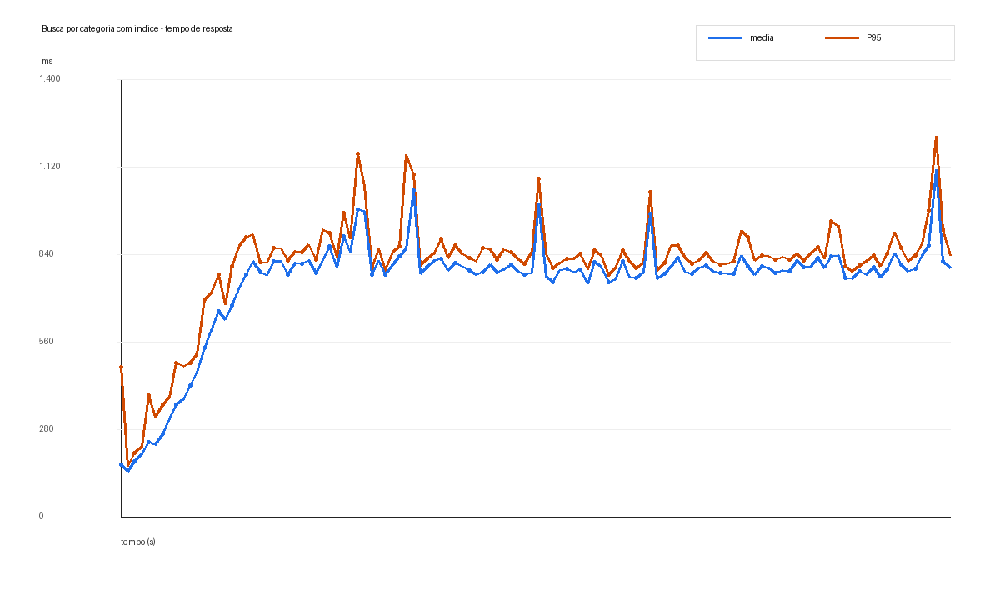
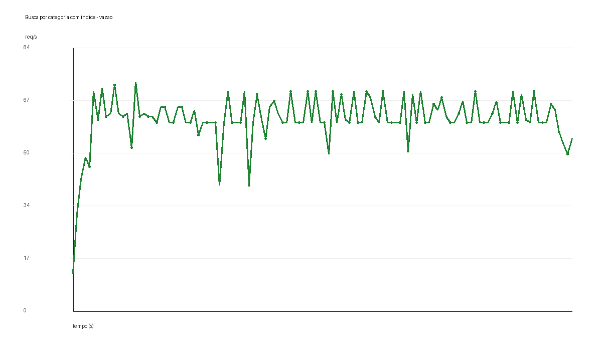
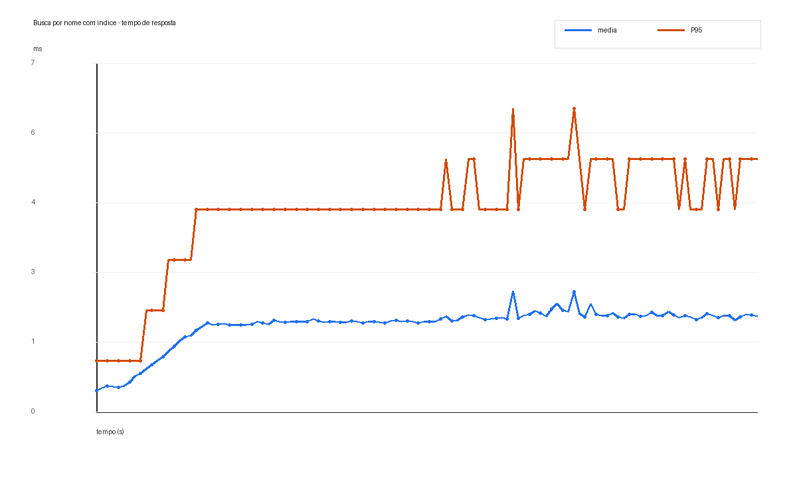
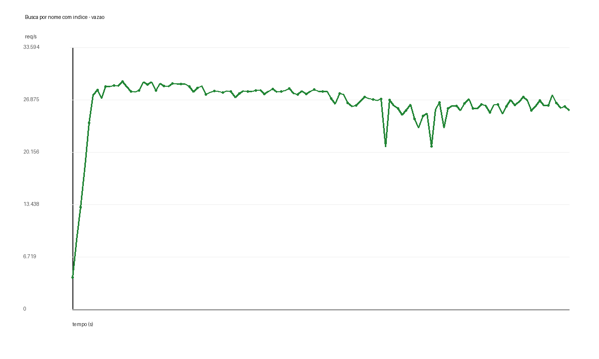

# Resultados dos Testes de Carga com Indices - 2026-06-26

## Objetivo

Este teste valida o impacto da criacao de indices em uma base relacional grande usada como catalogo de produtos.

A base foi recriada com:

- 10.000.000 produtos
- 1.000 marcas
- 500 categorias
- Indice em `products.category_id`
- Indice em `products.name`

A migration adicionada foi:

```sql
CREATE INDEX idx_products_category_id ON products (category_id);

CREATE INDEX idx_products_name ON products (name);
```

O teste usa os mesmos parametros do baseline sem indices:

- Ferramenta: Apache JMeter
- Usuarios concorrentes: 50
- Ramp-up: 20 segundos
- Duracao: 120 segundos
- Aplicacao: Spring Boot em `localhost:8080`
- Banco de dados: PostgreSQL 16 via Docker Compose

Relatorios brutos do JMeter:

- Categoria com indice: `build/jmeter-report/products-by-category-indexed-20260626-1623/index.html`
- Nome com indice: `build/jmeter-report/products-by-name-indexed-20260626-1633/index.html`

## Ajuste da Consulta por Nome

A consulta por categoria continua direta:

```sql
SELECT * FROM products WHERE category_id = ?
```

A busca por nome continua usando `LIKE`, mas passou a incluir um intervalo lexicografico de prefixo:

```sql
SELECT *
FROM products
WHERE name >= ?
  AND name < ?
  AND name LIKE ?
```

Esse ajuste importa porque um B-tree portavel em `name` nao resolve bem uma busca do tipo `%termo%`. Para demonstrar o efeito do indice sem depender de extensoes ou operator classes especificas de PostgreSQL, a busca foi mantida como prefixo: `termo%`.

O `EXPLAIN` confirmou uso dos indices:

```text
Bitmap Index Scan on idx_products_category_id
Index Scan using idx_products_name on products
```

## Cenario 1: Busca por Categoria

Endpoint:

```http
GET /products?categoryId=1
```

Este endpoint retorna cerca de 20.000 produtos para a categoria testada. Mesmo com indice, ainda existe custo relevante para materializar as linhas e transferir um JSON grande.





Resultados com indice:

| Metrica | Valor |
| --- | ---: |
| Requisicoes | 7.326 |
| Erros | 0% |
| Vazao | 60,69 req/s |
| Tempo medio de resposta | 754 ms |
| Mediana do tempo de resposta | 787 ms |
| P90 | 855 ms |
| P95 | 917 ms |
| P99 | 1.079 ms |
| Tempo maximo de resposta | 1.559 ms |

Comparacao com o baseline sem indice:

| Metrica | Sem indice | Com indice | Efeito |
| --- | ---: | ---: | ---: |
| Requisicoes | 1.479 | 7.326 | 4,95x mais |
| Vazao | 11,93 req/s | 60,69 req/s | 5,09x maior |
| Tempo medio | 3.795 ms | 754 ms | 5,03x menor |
| P95 | 4.843 ms | 917 ms | 5,28x menor |
| P99 | 5.007 ms | 1.079 ms | 4,64x menor |

Interpretacao:

O indice em `category_id` removeu o custo principal da varredura completa da tabela. O endpoint passou de aproximadamente 12 req/s para 61 req/s. A latencia media caiu de quase 3,8 segundos para cerca de 754 ms.

Ainda assim, o endpoint nao fica barato, porque cada requisicao retorna muitos produtos. O gargalo restante passa a ser materializacao de linhas, serializacao JSON e transferencia de payload grande.

## Cenario 2: Busca por Nome

Endpoint:

```http
GET /products?name=Product%209999999
```

Este endpoint retorna uma resposta pequena. Por isso, ele isola melhor o impacto do indice na selecao de linhas.





Resultados com indice:

| Metrica | Valor |
| --- | ---: |
| Requisicoes | 3.178.152 |
| Erros | 0% |
| Vazao | 26.491,22 req/s |
| Tempo medio de resposta | 1,72 ms |
| Mediana do tempo de resposta | 2 ms |
| P90 | 4 ms |
| P95 | 5 ms |
| P99 | 6 ms |
| Tempo maximo de resposta | 35 ms |

Comparacao com o baseline sem indice:

| Metrica | Sem indice | Com indice | Efeito |
| --- | ---: | ---: | ---: |
| Requisicoes | 1.348 | 3.178.152 | 2.357,68x mais |
| Vazao | 10,82 req/s | 26.491,22 req/s | 2.448,36x maior |
| Tempo medio | 4.174 ms | 1,72 ms | 2.426,74x menor |
| P95 | 5.350 ms | 5 ms | 1.070,00x menor |
| P99 | 5.555 ms | 6 ms | 925,83x menor |

Interpretacao:

Este e o resultado mais didatico do teste. Sem indice, a busca por nome retornava quase nada, mas ainda precisava varrer uma tabela de 10 milhoes de linhas. Com indice e uma consulta escrita para permitir busca por prefixo, o banco localiza o pequeno intervalo de nomes diretamente pelo B-tree.

O ganho foi extremo: de cerca de 11 req/s para mais de 26 mil req/s, com P95 caindo de mais de 5 segundos para 5 ms.

## Conclusao

Os indices mudaram completamente o comportamento da aplicacao:

- A busca por categoria melhorou cerca de 5x, mas continua limitada pelo volume de dados retornado.
- A busca por nome melhorou mais de 2.400x em vazao, porque retorna poucos dados e passou a usar o indice de forma seletiva.

A conclusao pratica e que indice nao e apenas uma otimizacao opcional em rotas de leitura muito acessadas. Em tabelas grandes, ele pode ser a diferenca entre uma API saturada com poucos usuarios e uma API capaz de absorver picos de leitura.

Tambem ha uma segunda licao: criar um indice nao basta se a consulta nao puder usa-lo. Para `LIKE`, uma busca com wildcard no inicio (`%termo%`) tende a continuar cara. Para um B-tree simples e portavel, o desenho da consulta precisa favorecer busca por prefixo ou intervalo.
