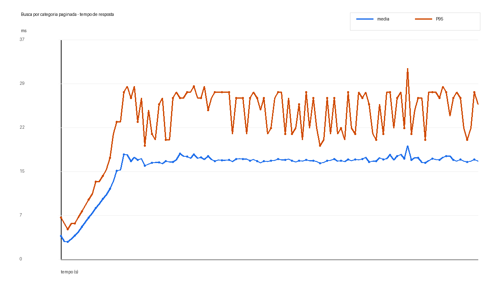
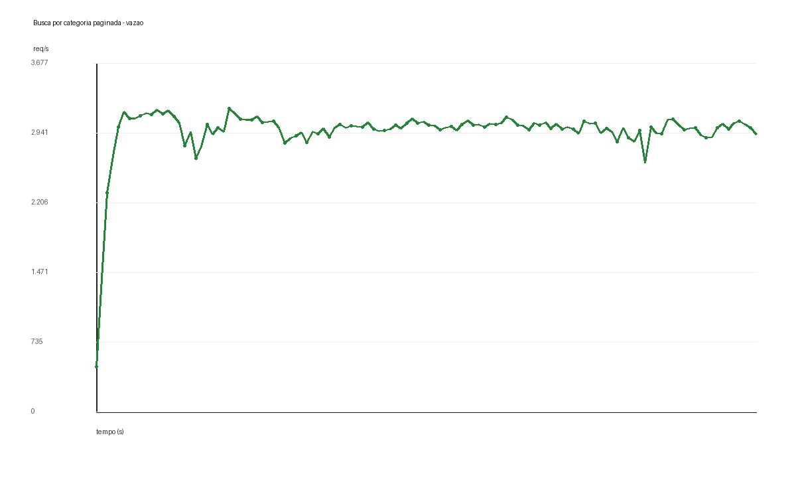
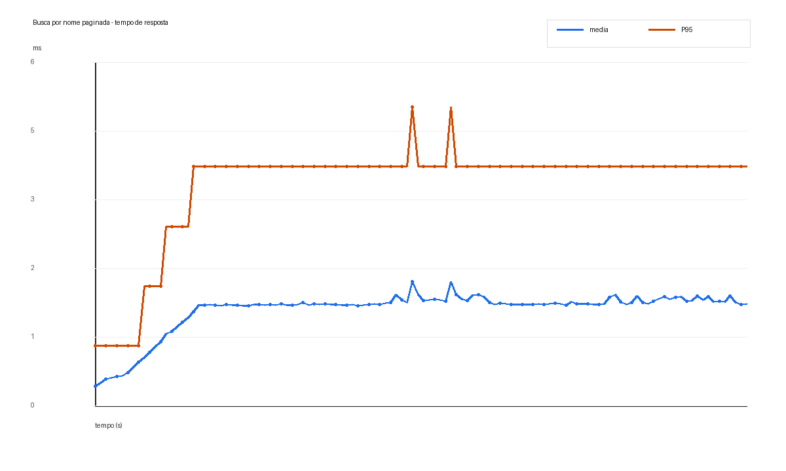
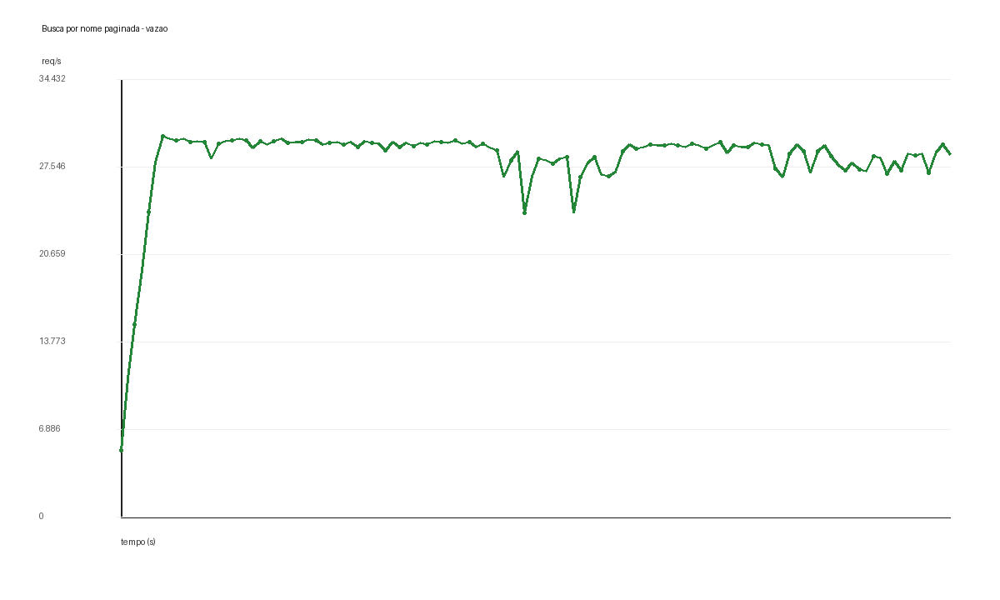

# Resultados dos Testes de Carga com Paginacao - 2026-06-27

## Objetivo

Este teste valida o impacto de paginacao no endpoint de catalogo depois da criacao dos indices.

O cenario anterior com indices resolveu o custo de localizacao das linhas, mas a busca por categoria ainda retornava cerca de 20.000 produtos por requisicao. Isso mantinha um payload grande e deslocava o gargalo para materializacao de linhas, serializacao JSON e transferencia de dados.

A mudanca desta etapa foi transformar o endpoint em uma busca paginada:

```http
GET /products?categoryId=1&page=0&size=50
GET /products?name=Product%209999999&page=0&size=50
```

A resposta agora e um slice:

```json
{
  "content": [],
  "page": 0,
  "size": 50,
  "count": 50,
  "hasNext": true
}
```

O endpoint evita `COUNT(*)` de proposito. Para uma rota de catalogo sob carga, contar o total a cada requisicao pode criar uma segunda consulta cara. Em vez disso, a implementacao busca `size + 1` registros para calcular `hasNext`.

## Configuracao do Teste

- Ferramenta: Apache JMeter
- Usuarios concorrentes: 50
- Ramp-up: 20 segundos
- Duracao: 120 segundos
- Aplicacao: Spring Boot em `localhost:8080`
- Banco de dados: PostgreSQL 16 via Docker Compose
- Massa: 10.000.000 produtos, 1.000 marcas e 500 categorias
- Pagina testada: `page=0`
- Tamanho da pagina: `size=50`

Relatorios brutos do JMeter:

- Categoria paginada: `build/jmeter-report/products-by-category-paginated-20260627-1403/index.html`
- Nome paginado: `build/jmeter-report/products-by-name-paginated-20260627-1408/index.html`

## Cenario 1: Busca por Categoria Paginada

Endpoint:

```http
GET /products?categoryId=1&page=0&size=50
```

Consulta executada:

```sql
SELECT *
FROM products
WHERE category_id = ?
ORDER BY id
LIMIT ?
OFFSET ?
```





Resultados com paginacao:

| Metrica | Valor |
| --- | ---: |
| Requisicoes | 355.143 |
| Erros | 0% |
| Vazao | 2.959,97 req/s |
| Tempo medio de resposta | 15,50 ms |
| Mediana do tempo de resposta | 16 ms |
| P90 | 19 ms |
| P95 | 26 ms |
| P99 | 31 ms |
| Tempo maximo de resposta | 87 ms |

Comparacao com o cenario com indice, mas sem paginacao:

| Metrica | Com indice sem paginacao | Com indice e paginacao | Efeito |
| --- | ---: | ---: | ---: |
| Requisicoes | 7.326 | 355.143 | 48,48x mais |
| Vazao | 60,69 req/s | 2.959,97 req/s | 48,77x maior |
| Tempo medio | 754 ms | 15,50 ms | 48,67x menor |
| P95 | 917 ms | 26 ms | 35,27x menor |
| P99 | 1.079 ms | 31 ms | 34,81x menor |

Interpretacao:

Esta e a principal motivacao da paginacao. O indice ja permitia encontrar os produtos da categoria, mas a API ainda precisava devolver cerca de 20.000 produtos em cada resposta. Com `size=50`, a aplicacao passa a materializar e serializar apenas uma pequena fatia do resultado.

O ganho foi expressivo: a vazao subiu de aproximadamente 61 req/s para quase 2.960 req/s, e o P95 caiu de 917 ms para 26 ms.

## Cenario 2: Busca por Nome Paginada

Endpoint:

```http
GET /products?name=Product%209999999&page=0&size=50
```

Consulta executada:

```sql
SELECT *
FROM products
WHERE name >= ?
  AND name < ?
  AND name LIKE ?
ORDER BY name
LIMIT ?
OFFSET ?
```





Resultados com paginacao:

| Metrica | Valor |
| --- | ---: |
| Requisicoes | 3.376.539 |
| Erros | 0% |
| Vazao | 28.142,52 req/s |
| Tempo medio de resposta | 1,62 ms |
| Mediana do tempo de resposta | 2 ms |
| P90 | 3 ms |
| P95 | 4 ms |
| P99 | 6 ms |
| Tempo maximo de resposta | 28 ms |

Comparacao com o cenario com indice, mas sem paginacao:

| Metrica | Com indice sem paginacao | Com indice e paginacao | Efeito |
| --- | ---: | ---: | ---: |
| Requisicoes | 3.178.152 | 3.376.539 | 1,06x mais |
| Vazao | 26.491,22 req/s | 28.142,52 req/s | 1,06x maior |
| Tempo medio | 1,72 ms | 1,62 ms | 1,06x menor |
| P95 | 5 ms | 4 ms | 1,25x menor |
| P99 | 6 ms | 6 ms | sem mudanca |

Interpretacao:

A busca por nome ja era seletiva depois da correcao dos indices e da consulta por prefixo. Como ela retorna poucos registros, a paginacao nao muda tanto o resultado quanto no caso da categoria.

Mesmo assim, a resposta paginada mantem o contrato consistente e protege o endpoint caso uma busca por prefixo retorne muitos produtos.

## Conclusao

A paginacao resolve uma dimensao diferente do problema.

Indices reduzem o custo de localizar linhas. Paginacao reduz o custo de retornar linhas.

No cenario de categoria, o banco ja encontrava os registros com indice, mas a API ainda sofria com payload grande. Com paginacao, a rota ficou adequada para um cenario de pico: P95 em 26 ms e vazao proxima de 3.000 req/s.

No cenario de nome, o ganho foi menor porque a consulta ja era seletiva. Ainda assim, a paginacao deixa o contrato da API mais seguro e previsivel para buscas que possam retornar muitos resultados.
