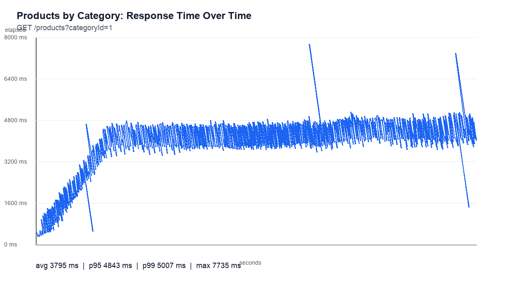
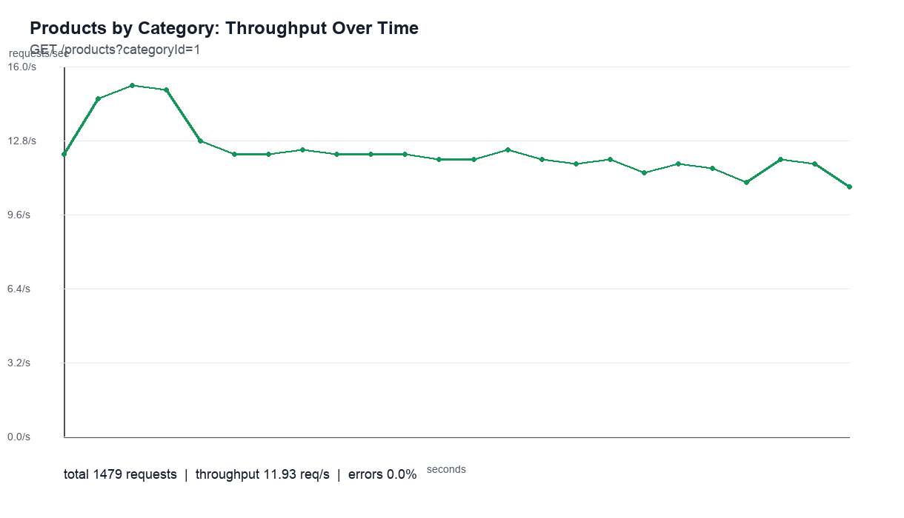
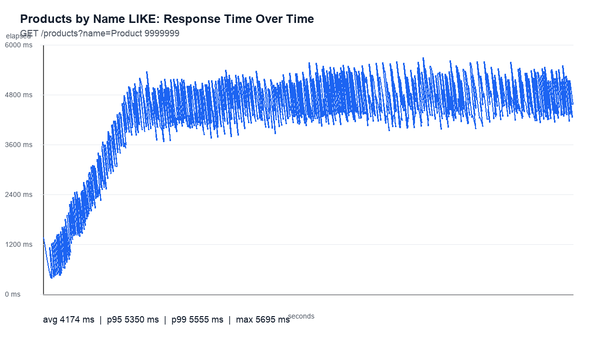
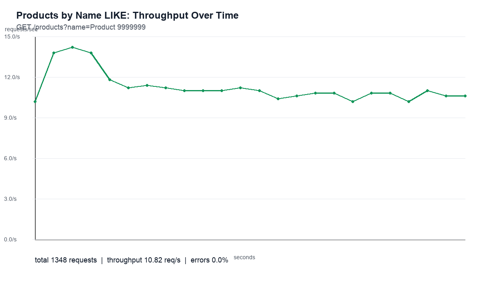

# Resultados dos Testes de Carga - 2026-06-26

## Objetivo

Este teste demonstra o impacto de performance ao consultar uma tabela relacional grande sem indices secundarios, em um cenario de alto trafego semelhante a um pico de Black Friday.

O banco de dados foi recriado e populado com:

- 10.000.000 produtos
- 1.000 marcas
- 500 categorias
- Nenhum indice secundario em `products.category_id`
- Nenhum indice secundario em `products.name`

Dois endpoints foram testados com Apache JMeter:

```http
GET /products?categoryId=1
GET /products?name=Product%209999999
```

O repository executa intencionalmente:

```sql
SELECT * FROM products WHERE category_id = ?
SELECT * FROM products WHERE name LIKE ?
```

## Configuracao do Teste

- Ferramenta: Apache JMeter
- Usuarios concorrentes: 50
- Ramp-up: 20 segundos
- Duracao: 120 segundos
- Aplicacao: Spring Boot em `localhost:8080`
- Banco de dados: PostgreSQL 16 via Docker Compose

Relatorios brutos do JMeter:

- Relatorio por categoria: `build/jmeter-report/products-by-category-20260626-1446/index.html`
- Relatorio por nome: `build/jmeter-report/products-by-name-20260626-1446/index.html`

## Cenario 1: Busca por Categoria

Endpoint:

```http
GET /products?categoryId=1
```

Esta consulta retorna muitas linhas. Nesta massa de dados, cada categoria possui cerca de 20.000 produtos, entao o endpoint combina uma varredura de tabela sem indice com uma resposta JSON grande.





Resultados:

| Metrica | Valor |
| --- | ---: |
| Requisicoes | 1.479 |
| Erros | 0% |
| Vazao | 11,93 req/s |
| Tempo medio de resposta | 3.795 ms |
| Mediana do tempo de resposta | 3.944 ms |
| P90 | 4.735 ms |
| P95 | 4.843 ms |
| P99 | 5.007 ms |
| Tempo maximo de resposta | 7.735 ms |
| Tamanho da resposta | ~7,43 MB/requisicao |
| Total transferido | ~11,0 GB |

Interpretacao:

O endpoint permanece tecnicamente estavel, sem erros HTTP, mas satura rapidamente. Com 50 usuarios, a vazao fica em torno de 12 requisicoes por segundo e a latencia entra na faixa de varios segundos. Esse resultado mistura tres custos: varrer 10 milhoes de linhas sem indice, materializar muitas linhas e serializar/transferir uma resposta JSON grande.

## Cenario 2: Busca por Nome

Endpoint:

```http
GET /products?name=Product%209999999
```

Esta consulta retorna uma resposta muito pequena, mas ainda usa `LIKE` em uma coluna sem indice dentro de uma tabela com 10 milhoes de linhas.





Resultados:

| Metrica | Valor |
| --- | ---: |
| Requisicoes | 1.348 |
| Erros | 0% |
| Vazao | 10,82 req/s |
| Tempo medio de resposta | 4.174 ms |
| Mediana do tempo de resposta | 4.359 ms |
| P90 | 5.227 ms |
| P95 | 5.350 ms |
| P99 | 5.555 ms |
| Tempo maximo de resposta | 5.695 ms |
| Tamanho da resposta | ~533 bytes/requisicao |
| Total transferido | ~0,7 MB |

Interpretacao:

Este cenario isola melhor o problema do banco de dados. A resposta e pequena, entao rede e tamanho do payload JSON nao sao o principal fator. Mesmo assim, o tempo medio de resposta fica acima de 4 segundos e o P95 fica acima de 5 segundos. O custo vem da varredura de uma tabela grande sem um indice capaz de apoiar a busca por nome.

## Conclusao

A busca por nome e a demonstracao mais forte do problema de ausencia de indice, porque retorna quase nenhum dado e ainda assim apresenta alta latencia. A busca por categoria demonstra o impacto combinado em producao: filtro sem indice mais payload grande.

Neste perfil de carga, os dois endpoints ficam limitados a aproximadamente 11 a 12 requisicoes por segundo, com P95 em torno de 5 segundos. Para um pico de trafego no estilo Black Friday, esse resultado seria inaceitavel para uma rota de leitura de catalogo de produtos.

O proximo passo didatico e adicionar indices direcionados e executar novamente os mesmos planos do JMeter:

```sql
CREATE INDEX idx_products_category_id ON products (category_id);
CREATE INDEX idx_products_name ON products (name);
```

Depois, comparar vazao, latencia P95/P99 e CPU/IO do banco de dados contra esta linha de base.
