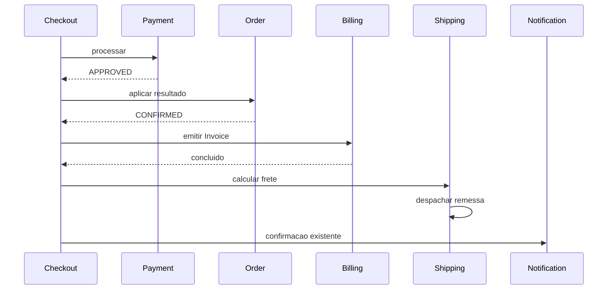

# Spec: Billing e Shipping no monolito modular

**Status:** Aprovada para planejamento
**Data:** 2026-08-18
**Branch de referencia:** `monolith-first`

## Contexto

O Nexus Shopping e um e-commerce didatico organizado como monolito modular
hexagonal. Product, Customer, Cart, Inventory, Order, Payment e Notification
ja sustentam a compra. Checkout e um processo de aplicacao que os coordena por
portas e ACLs, e nao um bounded context.

Esta evolucao introduz Billing e Shipping no caminho de pagamento aprovado:

```text
Payment aprovado -> Order confirmado -> Billing -> Shipping -> Notification
```

O objetivo e esbocar duas fronteiras de integracao externa sem criar
persistencia, entidades, endpoints ou integracoes reais.

## Nomes e ownership

| Papel | Nome | Responsabilidade |
| --- | --- | --- |
| Bounded context | `Billing` | Emitir documentos comerciais. |
| Entidade futura | `Invoice` | Nota fiscal da venda, ligada ao pedido. |
| Entidade futura | `Receipt` | Comprovante de quitacao, ligado ao pagamento aprovado. |
| Bounded context | `Shipping` | Calcular frete e despachar a remessa. |
| Entidade futura | `Shipment` | Remessa encaminhada a transportadora. |

Payment continua dono do fato de que um pagamento foi aprovado. Billing podera
emitir Receipt no futuro a partir desse fato, sem assumir tentativas,
autorizacao ou conciliacao de pagamento.

Nao criar `Document`, `BillingDocument`, `BaseDocument` ou `Bill`.
Invoice e Receipt terao regras e referencias diferentes quando precisarem de
persistencia; uma abstracao comum agora nao oferece comportamento comum.

## Arquitetura e fluxo



Checkout adiciona duas portas de saida:

```kotlin
interface BillingGateway {
    fun issueInvoice(command: CheckoutInvoiceCommand)
}

interface ShippingGateway {
    fun process(command: CheckoutShippingCommand)
}
```

Os comandos pertencem a `checkout.application` e levam fatos de
`CheckoutOrderSnapshot`: identificacao do pedido, cliente, endereco, itens e
total. Os ACLs em `checkout.adapter.outbound.acl` os convertem para comandos
proprios dos contextos destinatarios e chamam seus input ports.

Billing e Shipping nao importam Checkout, Order, Payment, Notification nem um
ao outro. Checkout.application tampouco importa Billing ou Shipping; somente
seus gateways. A dependencia dos input ports novos e permitida apenas nos ACLs.

## Billing minimo

```text
billing/
  application/
    command/IssueInvoiceCommand.kt
    port/inbound/IssueInvoiceInputPort.kt
    port/outbound/InvoiceIssuerPort.kt
    usecase/IssueInvoiceUseCase.kt
  adapter/outbound/issuer/InvoiceIssuerAdapter.kt
```

`IssueInvoiceCommand` e um snapshot proprio de Billing. O use case apenas
delega para `InvoiceIssuerPort`. `InvoiceIssuerAdapter` registra
`billing.invoice.issued` com a referencia do pedido e conclui com sucesso.
Ele nao e chamado Fake, Mock, Simulated ou Logging. Um comentario local marca
o ponto de troca futura para um emissor fiscal real.

Nao ha Invoice em memoria, entidade, repositorio, tabela, migration, retorno
HTTP ou regra tributaria.

## Shipping minimo

```text
shipping/
  application/
    command/ProcessShippingCommand.kt
    port/inbound/ProcessShippingInputPort.kt
    port/outbound/CarrierPort.kt
    usecase/ProcessShippingUseCase.kt
  adapter/outbound/carrier/CarrierAdapter.kt
```

`ProcessShippingCommand` e o snapshot proprio de Shipping. O use case chama
`CarrierPort.calculateFreight(command)` e, em seguida,
`CarrierPort.dispatch(command)`. `CarrierAdapter` registra
`shipping.freight.calculated` e `shipping.shipment.dispatched`, nessa
ordem, e conclui ambas as operacoes com sucesso.

Shipping nao calcula valor, nao altera o total do pedido, nao seleciona servico,
nao cria rastreio e nao persiste Shipment. Um comentario no adapter marca a
substituicao futura por uma transportadora.

## Escopo e limites aceitos

Dentro do escopo:

- Esqueleto hexagonal de Billing para emitir Invoice.
- Esqueleto hexagonal de Shipping para calcular e despachar.
- Orquestracao sincrona em Checkout depois de Payment APPROVED.
- Testes de delegacao, ordem e logs.
- Atualizacao da documentacao de contextos.

Fora do escopo:

- Receipt, Invoice e Shipment persistidos.
- Idempotencia, retry, outbox, broker, estados ou recuperacao de falha.
- NF-e real, tributacao, XML, assinatura, autorizacao ou emissor real.
- Frete real, custo no checkout, transportadora selecionada, rastreio e entrega.
- Endpoints, OpenAPI, migrations e mudancas em Notification.

Em especial, Payment ja reproduz seu resultado terminal em um replay de
checkout. Como Billing e Shipping nao possuem persistencia neste corte, um
replay aprovado tambem pode registrar nova emissao e novo despacho. Esse efeito
duplicado e um limite didatico assumido, nao um problema escondido por uma
abstracao prematura.

Se um adapter futuro lancar erro, Checkout interrompe a sequencia: falha em
Billing impede Shipping; falha em Shipping impede a notificacao posterior. Nao
ha compensacao neste corte.

## Testes de aceitacao

1. Pagamento aprovado confirma Order, chama Billing, chama Shipping na ordem
   calculo -> despacho e entao preserva a notificacao atual.
2. Pagamento REQUESTED ou REJECTED nao chama Billing nem Shipping.
3. Replay aprovado pode chamar Billing e Shipping novamente; o teste documenta
   esse limite sem criar idempotencia.
4. Billing e Shipping encaminham seus comandos para as portas corretas.
5. Os adapters registram somente a referencia do pedido, sem documento,
   endereco completo ou token de pagamento.
6. As regras de arquitetura proíbem dependencias dos novos contextos para os
   contextos existentes ou Checkout; apenas ACLs de Checkout usam seus input
   ports.

## Evolucao posterior

Billing pode ganhar Invoice persistida, idempotencia e, depois, Receipt emitido
a partir de Payment aprovado. Shipping pode ganhar Shipment persistida,
cotacao, selecao de servico, rastreio e integracao real. Essas evolucoes devem
ser novas specs, nao extensoes implicitas deste corte.
